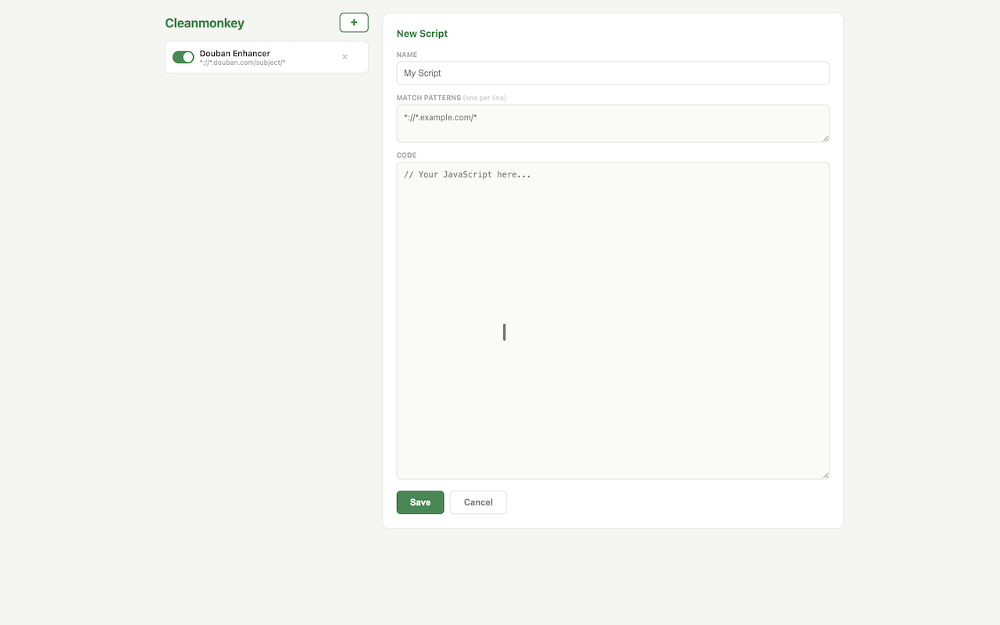

# cleanmonkey

The extension for running user scripts on any website.

Example screenshot of adding a play button to douban:

[![get-chrome-ext][chrome_badge]][chrome_link]
[![get-firefox-addon][firefox_badge]][firefox_link]

[chrome_link]: https://chrome.google.com/webstore/detail/bfclngdpfgejkkccpgfdkecicjmbgahi
[chrome_badge]: ./img/chrome-badge.png
[firefox_link]: https://addons.mozilla.org/firefox/addon/cleanmonkey
[firefox_badge]: ./img/firefox-badge.png
